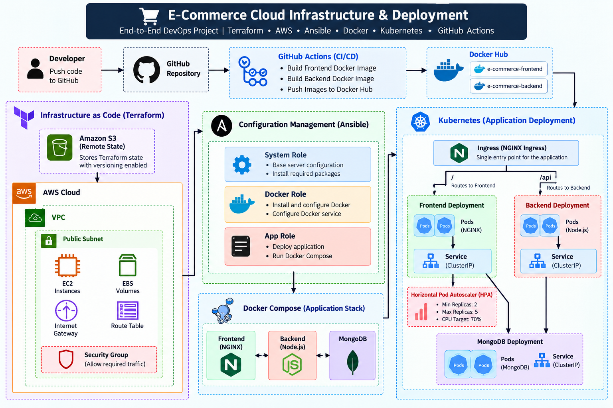

# E-Commerce Cloud Infrastructure & Deployment

An end-to-end DevOps project for deploying a multi-tier e-commerce application using AWS, Terraform, Docker, Ansible, Kubernetes, and GitHub Actions.

The project covers infrastructure provisioning, server configuration, containerization, Kubernetes orchestration, traffic routing, autoscaling, and automated Docker image delivery.

## Architecture



AWS Infrastructure
        |
     Terraform
        |
        +-- VPC
        +-- Public Subnet
        +-- Internet Gateway
        +-- Route Table
        +-- Security Group
        +-- EC2 Instances
        +-- EBS Volumes

Terraform State
        |
        +-- Amazon S3 Remote Backend


Server Configuration
        |
      Ansible
        |
        +-- System Configuration
        +-- Docker Installation
        +-- Application Deployment
```

## Tech Stack

### Infrastructure

* AWS
* Terraform
* Amazon EC2
* Amazon EBS
* Amazon VPC
* Amazon S3

### Configuration Management

* Ansible
* Ansible Roles

### Containerization

* Docker
* Docker Compose
* Docker Hub

### Container Orchestration

* Kubernetes
* Kubernetes Deployments
* Kubernetes Services
* NGINX Ingress
* Horizontal Pod Autoscaler

### CI/CD

* GitHub Actions

### Application

* NGINX Frontend
* Node.js Backend
* MongoDB

---

## Terraform Infrastructure

Terraform is used to provision the AWS infrastructure.

The Terraform configuration follows a modular structure.

### Network Module

Responsible for provisioning:

* VPC
* Public subnet
* Internet Gateway
* Route Table
* Route Table Association
* Security Group

### Compute Module

Responsible for provisioning:

* EC2 instances
* Root EBS volumes
* Optional additional EBS volumes
* EBS volume attachments

VM configuration is defined using Terraform variables, allowing multiple EC2 instances with different instance types, AMIs, disk sizes, and additional disks.

---

## Terraform Remote State

Terraform state is stored remotely using an Amazon S3 backend.

```text
Terraform
    |
    v
Amazon S3
    |
terraform.tfstate
```

S3 Versioning is enabled on the Terraform state bucket to preserve previous state versions.

Sensitive and local Terraform files are excluded from Git, including:

```text
terraform.tfvars
.terraform/
*.tfstate
*.tfstate.backup
```

---

## Docker

The application is containerized using Docker.

The frontend uses an NGINX Alpine image to serve the static web application.

The project contains separate Docker images for:

```text
e-commerce-frontend
e-commerce-backend
```

A Docker Compose configuration is also included for running the complete application stack:

```text
Frontend
   |
Backend
   |
MongoDB
```

The backend connects to MongoDB through the internal Docker network.

---

## Ansible

Ansible is used for automated server configuration and application deployment.

The playbook uses separate roles:

```text
roles/
├── system/
├── docker/
└── app/
```

### System Role

Handles base server configuration.

### Docker Role

Handles Docker installation and configuration.

### Application Role

Handles deployment of the application stack.

This keeps configuration management separated into reusable roles instead of placing all configuration tasks in a single playbook.

---

## Kubernetes

The application can also be deployed to Kubernetes.

The Kubernetes configuration includes:

```text
k8s/
├── frontend-deployment.yml
├── frontend-service.yml
├── backend-deployment.yml
├── backend-service.yml
├── mongo-deployment.yml
├── mongo-service.yml
├── ingress.yml
└── hpa.yml
```

### Frontend

The frontend deployment runs multiple replicas of the NGINX-based frontend container.

### Backend

The backend runs as a separate Kubernetes Deployment and receives the MongoDB connection string through a Kubernetes Secret.

### MongoDB

MongoDB runs as a dedicated Deployment and is exposed internally through a Kubernetes Service.

---

## Kubernetes Ingress

Ingress provides a single entry point for application traffic.

Traffic is routed based on the request path:

```text
/
 |
 +----> Frontend Service

/api
 |
 +----> Backend Service
```

This allows frontend and backend traffic to be accessed through the same ingress layer.

---

## Horizontal Pod Autoscaling

The frontend uses a Kubernetes Horizontal Pod Autoscaler.

Current configuration:

```text
Minimum Replicas: 2
Maximum Replicas: 5
CPU Target:       70%
```

When average CPU utilization increases beyond the configured target, Kubernetes can automatically increase the number of frontend pods.

---

## CI/CD Pipeline

GitHub Actions automates the Docker image build and delivery process.

The workflow runs when code is pushed to the `main` branch.

```text
Push to main
      |
      v
GitHub Actions
      |
      +----> Build Backend Image
      |             |
      |             v
      |        Docker Hub
      |
      +----> Build Frontend Image
                    |
                    v
               Docker Hub
```

Docker Hub credentials are stored using GitHub Actions Secrets:

```text
DOCKER_USERNAME
DOCKER_PASSWORD
```

This prevents registry credentials from being hardcoded inside the workflow.

---

## Project Structure

```text
E-commerce/
│
├── .github/
│   └── workflows/
│       └── deploy.yml
│
├── ansible/
│   ├── roles/
│   │   ├── system/
│   │   ├── docker/
│   │   └── app/
│   ├── files/
│   │   └── docker-compose.yml
│   ├── inventory.ini
│   └── playbook.yml
│
├── k8s/
│   ├── frontend-deployment.yml
│   ├── frontend-service.yml
│   ├── backend-deployment.yml
│   ├── backend-service.yml
│   ├── mongo-deployment.yml
│   ├── mongo-service.yml
│   ├── ingress.yml
│   └── hpa.yml
│
├── terraform/
│   ├── modules/
│   │   ├── network/
│   │   └── compute/
│   ├── main.tf
│   ├── variables.tf
│   ├── outputs.tf
│   ├── provider.tf
│   └── s3.tf
│
├── backend/
├── pages/
├── css/
├── js/
├── images/
│
├── Dockerfile
├── .gitignore
└── README.md
```

## Terraform Deployment

Initialize Terraform:

```bash
cd terraform
terraform init
```

Validate the configuration:

```bash
terraform fmt -recursive
terraform validate
```

Review the infrastructure:

```bash
terraform plan
```

Deploy:

```bash
terraform apply
```

---

## Ansible Deployment

Run the Ansible playbook:

```bash
cd ansible
ansible-playbook -i inventory.ini playbook.yml
```

---

## Kubernetes Deployment

Deploy the Kubernetes resources:

```bash
kubectl apply -f k8s/
```

Check the application resources:

```bash
kubectl get deployments
kubectl get pods
kubectl get services
kubectl get ingress
kubectl get hpa
```

---

## Security

The repository excludes sensitive configuration files such as:

* Backend environment variables
* Kubernetes Secret manifests
* Terraform variable values
* Terraform state files
* Local Terraform provider files

Secrets used by the CI/CD pipeline are stored using GitHub Actions Secrets rather than being committed to the repository.

## Key DevOps Concepts Demonstrated

This project demonstrates practical experience with:

* Infrastructure as Code
* Modular Terraform
* Remote Terraform State
* AWS Infrastructure Provisioning
* Configuration Management
* Containerization
* Multi-container Applications
* Kubernetes Orchestration
* Service Discovery
* Ingress Routing
* Horizontal Pod Autoscaling
* Secret Management
* CI/CD Automation
* Docker Image Registries
